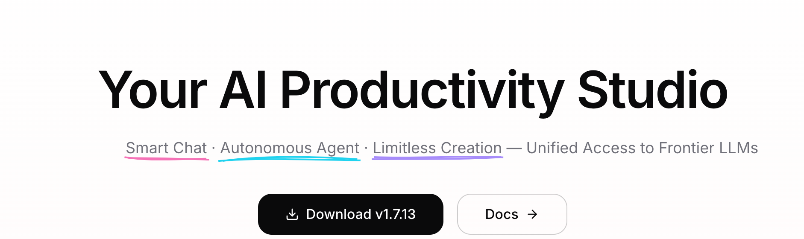
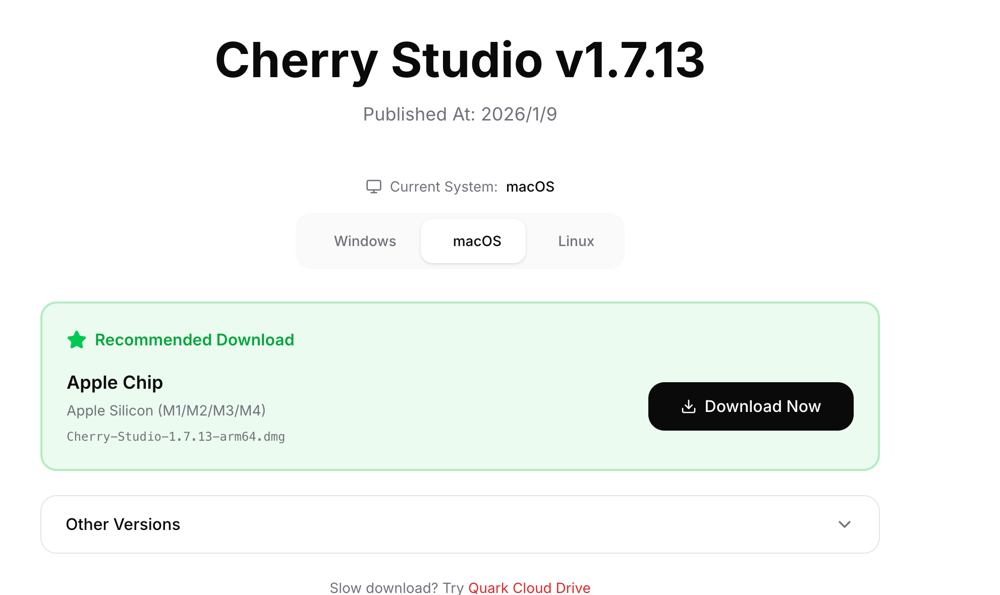
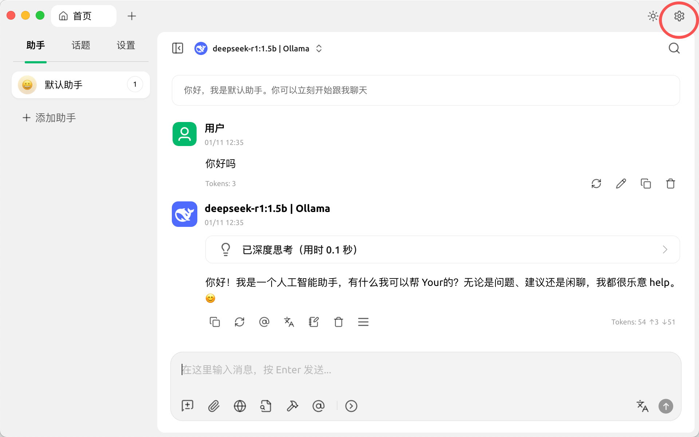
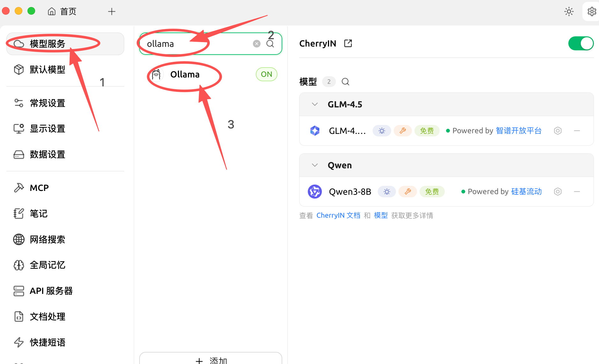
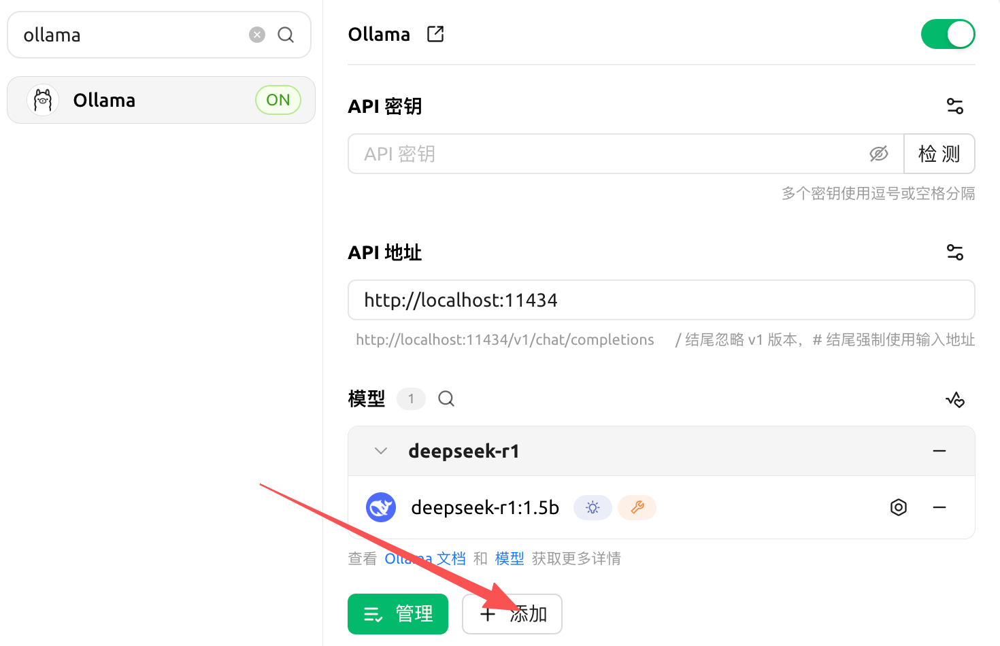
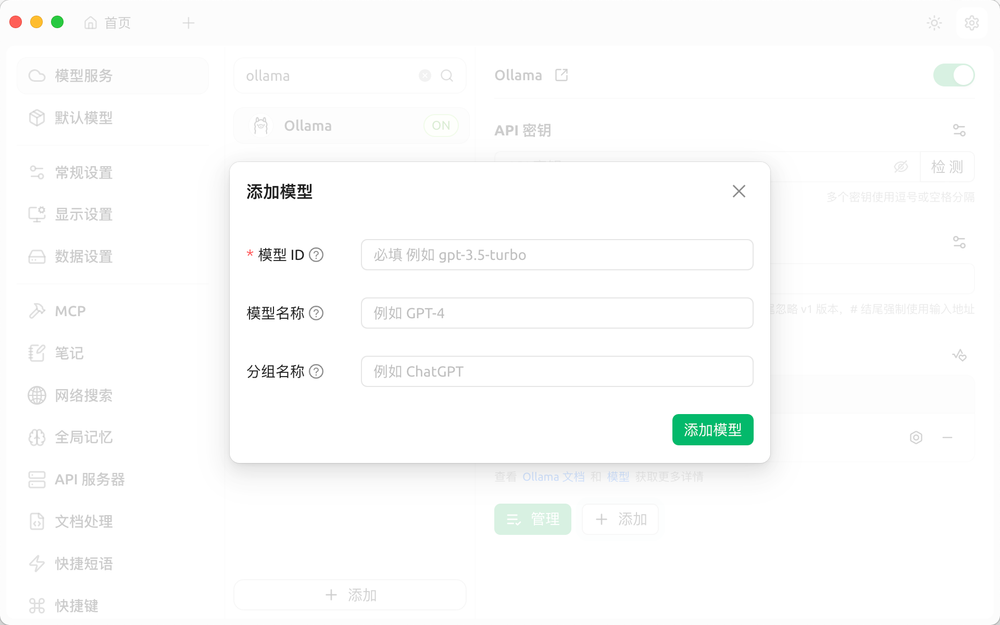
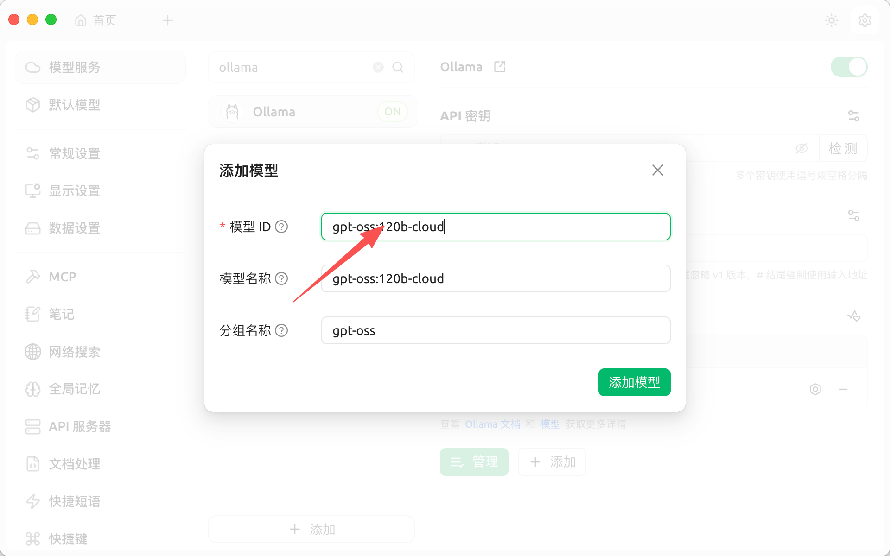
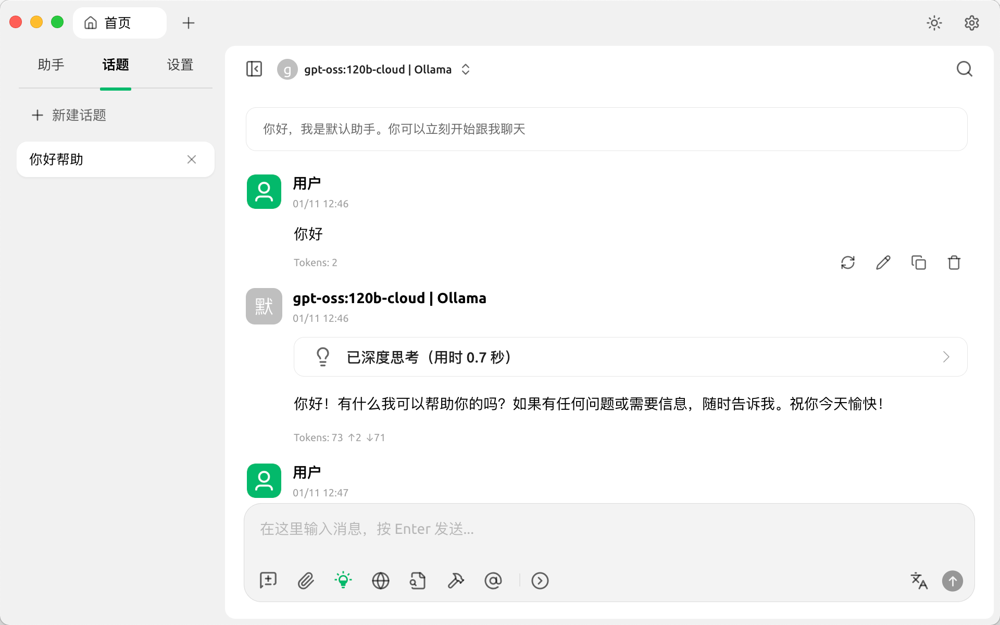

# 在 Cherry Studio 中使用 Ollama

本文介绍如何在 Cherry Studio 中接入 Ollama，并使用 Ollama 提供的本地模型或云模型。

## 1. 下载 Cherry Studio

访问 [Cherry Studio 官网](https://www.cherry-ai.com/)，根据操作系统下载安装包。



以 macOS 为例，请根据设备芯片选择对应版本。



安装完成后打开 Cherry Studio，按照提示完成初始化。

## 2. 接入 Ollama

进入 Cherry Studio 的模型服务设置页面，找到 Ollama。





确认 Ollama 服务已经启动，并将 API 地址设置为 `http://localhost:11434`。



点击“添加模型”。



在终端运行以下命令，查看已经拉取或可用的模型：

```bash
ollama list
```

将命令输出中的模型名称填写为模型 ID，其余信息可以由 Cherry Studio 自动补全。

如果希望所有推理都在本机完成，可以选择 `deepseek-r1:1.5b` 等本地模型。下面的截图以 `gpt-oss:120b-cloud` 为例；该模型属于 Ollama Cloud，请注意请求内容会发送到云端，并非完全本地运行。



添加模型后回到首页，选择该模型即可开始对话。


