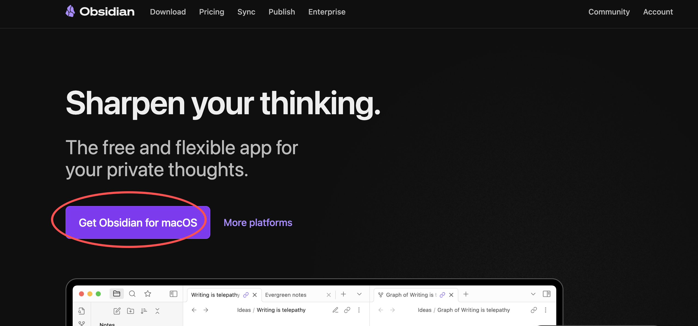
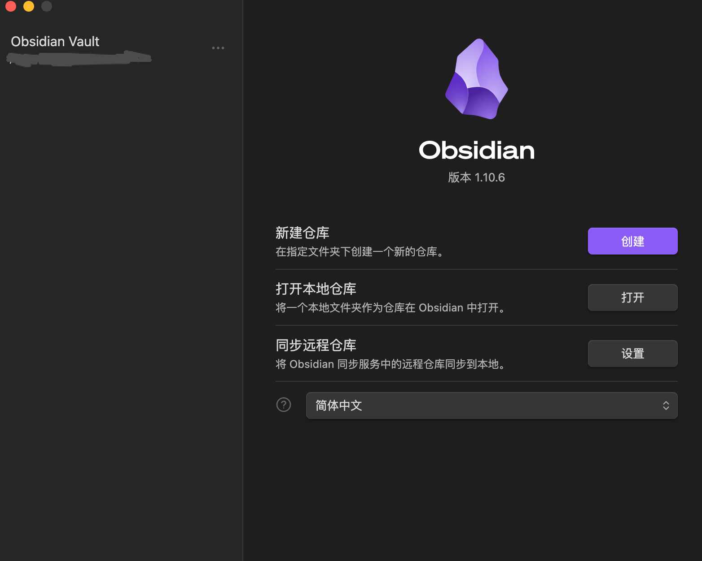
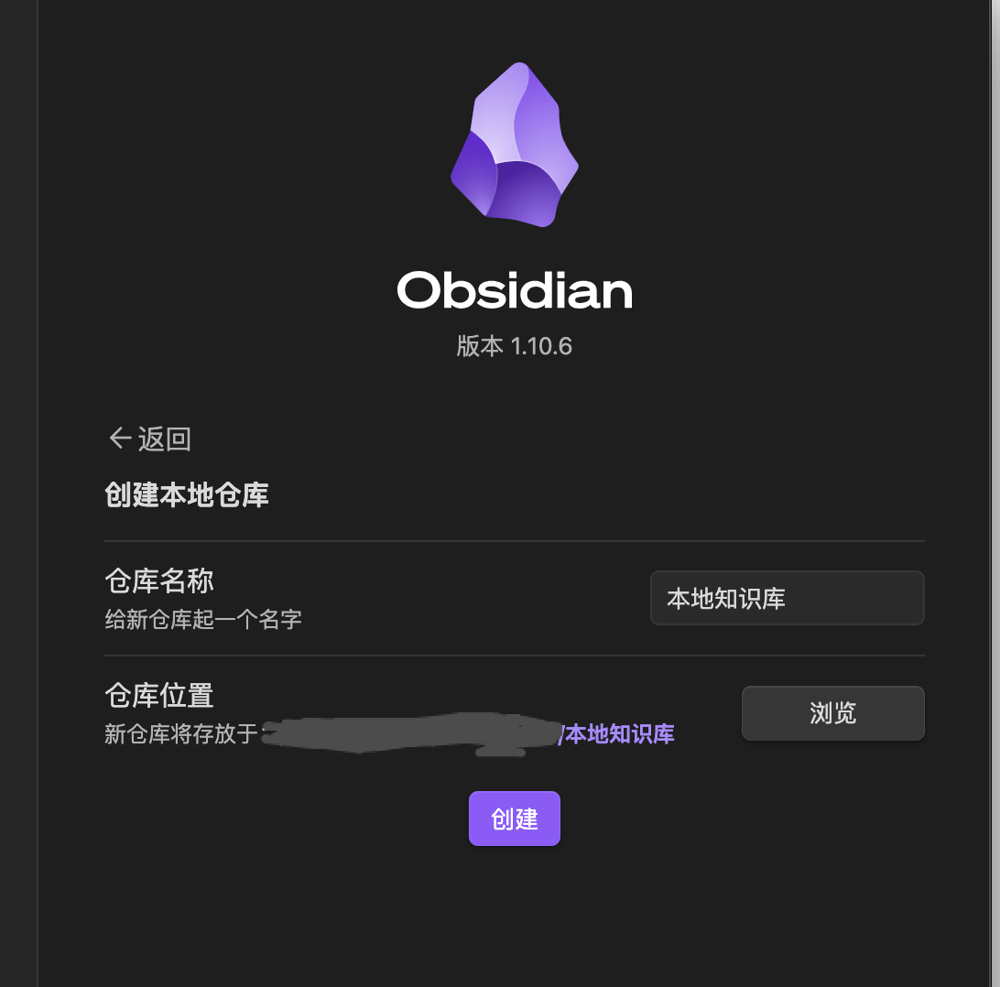
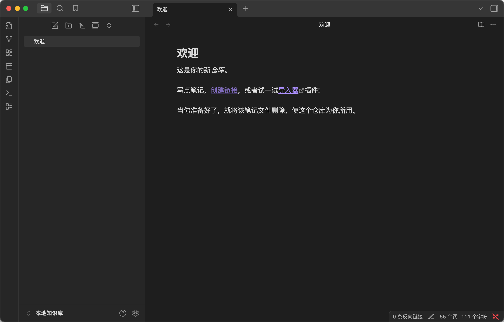
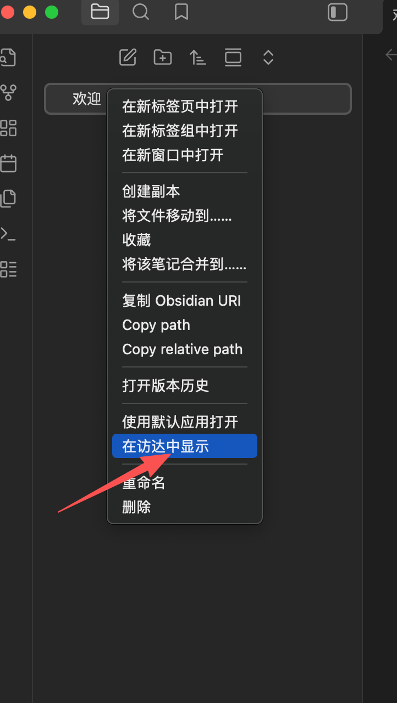

# 使用 Obsidian 构建 RAG：云端与本地方案

本文介绍如何读取本地 Obsidian 仓库，并使用 LlamaIndex 构建 RAG 应用。文中提供两种方案：

- DashScope 云端方案：语言模型和向量化服务均在云端运行，笔记内容会发送给服务提供商处理。
- Ollama 本地方案：语言模型和向量化模型均通过本机 Ollama 运行，适合更关注数据隐私的场景，但对本机性能要求更高。

请根据数据敏感程度、硬件条件和服务条款选择方案。不要将包含敏感信息的笔记发送到不受信任的云端服务。

## 1. 下载 Obsidian

访问 [Obsidian 官网](https://obsidian.md/)，根据操作系统下载安装包。



## 2. 创建 Obsidian 仓库

打开 Obsidian，选择“新建仓库”。



设置仓库名称和存放位置，然后完成创建。





## 3. 创建虚拟环境

可以使用 Conda 创建 Python 3.11 环境：

```bash
conda create -n handllm python=3.11
conda activate handllm
```

也可以使用 venv：

```bash
python3.11 -m venv handllm
source handllm/bin/activate
```

本教程使用锁定版本的依赖文件，以避免后续版本升级导致接口不兼容。在仓库根目录运行：

```bash
pip install -r notebook/C7/Obsidian_RAG/requirements.txt
```

## 4. 读取 Obsidian 笔记

可以在 Obsidian 中复制笔记路径，也可以在文件管理器中找到仓库目录。



将 `vault_path` 替换成 Obsidian 仓库的实际路径：

```python
from pathlib import Path

vault_path = Path("/path_to_local_knowledge")
md_files = list(vault_path.rglob("*.md"))
print(len(md_files))
print(vault_path)
```

## 5. 配置 DashScope API Key

本节及第 6 至第 8 节属于云端方案。如果只使用第 9 节的 Ollama 本地方案，可以跳过本节。

推荐通过环境变量配置密钥：

```bash
export DASHSCOPE_API_KEY="your-api-key"
```

也可以在 Python 进程中临时输入。以下代码不会把密钥写入磁盘：

```python
import getpass
import os

api_key = os.getenv("DASHSCOPE_API_KEY")
if not api_key:
    api_key = getpass.getpass("请输入 DASHSCOPE_API_KEY：").strip()
    os.environ["DASHSCOPE_API_KEY"] = api_key
```

不要把 API Key 写入 `Key.json` 或提交到 Git 仓库。如果密钥发生泄露，请立即在服务平台撤销并重新生成。

## 6. 使用 DashScope 建立并保存索引

以下代码会将 Obsidian 笔记发送到 DashScope 进行向量化：

```python
import os
from pathlib import Path

from llama_index.core import SimpleDirectoryReader, VectorStoreIndex
from llama_index.embeddings.dashscope import (
    DashScopeEmbedding,
    DashScopeTextEmbeddingModels,
)

documents = SimpleDirectoryReader(
    input_dir=Path("/path_to_local_knowledge"),
    recursive=True,
    required_exts=[".md"],
).load_data()

embed_model = DashScopeEmbedding(
    model_name=DashScopeTextEmbeddingModels.TEXT_EMBEDDING_V2,
)

index = VectorStoreIndex.from_documents(documents, embed_model=embed_model)
index.storage_context.persist(persist_dir="./storage_ali")
```

## 7. 在新进程中读取云端方案索引

LlamaIndex 不会把 embedding 实例和语言模型持久化到索引中。因此，关闭 Python 后再次加载索引时，必须重新创建与建索引时相同的 embedding，并重新配置查询使用的语言模型。

```python
import os

from llama_index.core import PromptTemplate, StorageContext, load_index_from_storage
from llama_index.embeddings.dashscope import (
    DashScopeEmbedding,
    DashScopeTextEmbeddingModels,
)
from llama_index.llms.openai_like import OpenAILike

QA_PROMPT_TMPL = (
    "Context information is below.\n"
    "---------------------\n"
    "{context_str}\n"
    "---------------------\n"
    "请仅根据上述提供的上下文信息回答问题。限制如下：\n"
    "1. 你的回答必须完全基于提供的上下文，不得使用你已有的外部知识。\n"
    "2. 如果上下文中没有关于该问题的答案，请直接回答："
    "'抱歉，在您的笔记库中没有找到相关描述。'\n"
    "3. 保持回答简洁专业。\n\n"
    "Query: {query_str}\n"
    "Answer: "
)
qa_prompt = PromptTemplate(QA_PROMPT_TMPL)

llm = OpenAILike(
    model="qwen-plus",
    api_base="https://dashscope.aliyuncs.com/compatible-mode/v1",
    api_key=os.environ["DASHSCOPE_API_KEY"],
    is_chat_model=True,
)
embed_model = DashScopeEmbedding(
    model_name=DashScopeTextEmbeddingModels.TEXT_EMBEDDING_V2,
)

storage_context = StorageContext.from_defaults(persist_dir="./storage_ali")
index = load_index_from_storage(storage_context, embed_model=embed_model)
print("成功从 ./storage_ali 加载索引")
```

## 8. 使用云端方案问答

```python
query_engine = index.as_query_engine(
    llm=llm,
    similarity_top_k=5,
    streaming=True,
    text_qa_template=qa_prompt,
)

response = query_engine.query("今天星期几了？")
response.print_response_stream()
```

输出示例：

```text
抱歉，在您的笔记库中没有找到相关描述。
```

继续提问：

```python
response = query_engine.query("读者为什么看网文？")
response.print_response_stream()
```

使用平台模型时，可能出现以下错误：

```text
APIError: Output data may contain inappropriate content.
```

这通常表示服务提供商的内容安全系统拦截了模型输出。请根据错误信息和平台规则调整查询内容。

## 9. 使用 Ollama 全本地方案

先拉取本地语言模型和 embedding 模型。模型大小应根据本机硬件调整：

```bash
ollama pull deepseek-r1:1.5b
ollama pull bge-m3:latest
```

### 9.1 进程 A：建立并保存本地索引

```python
from pathlib import Path

from llama_index.core import SimpleDirectoryReader, VectorStoreIndex
from llama_index.embeddings.ollama import OllamaEmbedding

documents = SimpleDirectoryReader(
    input_dir=Path("/path_to_local_knowledge"),
    recursive=True,
    required_exts=[".md"],
).load_data()

embed_model = OllamaEmbedding(model_name="bge-m3:latest")
index = VectorStoreIndex.from_documents(documents, embed_model=embed_model)
index.storage_context.persist(persist_dir="./storage")
```

运行完成后退出 Python，确保下面的加载步骤不依赖同一个解释器会话。

### 9.2 进程 B：重新加载索引并查询

```python
from llama_index.core import PromptTemplate, StorageContext, load_index_from_storage
from llama_index.embeddings.ollama import OllamaEmbedding
from llama_index.llms.ollama import Ollama

QA_PROMPT_TMPL = (
    "Context information is below.\n"
    "---------------------\n"
    "{context_str}\n"
    "---------------------\n"
    "请仅根据上述提供的上下文信息回答问题。限制如下：\n"
    "1. 你的回答必须完全基于提供的上下文，不得使用你已有的外部知识。\n"
    "2. 如果上下文中没有关于该问题的答案，请直接回答："
    "'抱歉，在您的笔记库中没有找到相关描述。'\n"
    "3. 保持回答简洁专业。\n\n"
    "Query: {query_str}\n"
    "Answer: "
)
qa_prompt = PromptTemplate(QA_PROMPT_TMPL)

embed_model = OllamaEmbedding(model_name="bge-m3:latest")
llm = Ollama(
    model="deepseek-r1:1.5b",
    temperature=0,
    request_timeout=120.0,
)

storage_context = StorageContext.from_defaults(persist_dir="./storage")
index = load_index_from_storage(
    storage_context,
    embed_model=embed_model,
)
print("成功从 ./storage 加载索引")

query_engine = index.as_query_engine(
    llm=llm,
    similarity_top_k=5,
    streaming=True,
    text_qa_template=qa_prompt,
)

response = query_engine.query("读者为什么看网文？")
response.print_response_stream()
```
